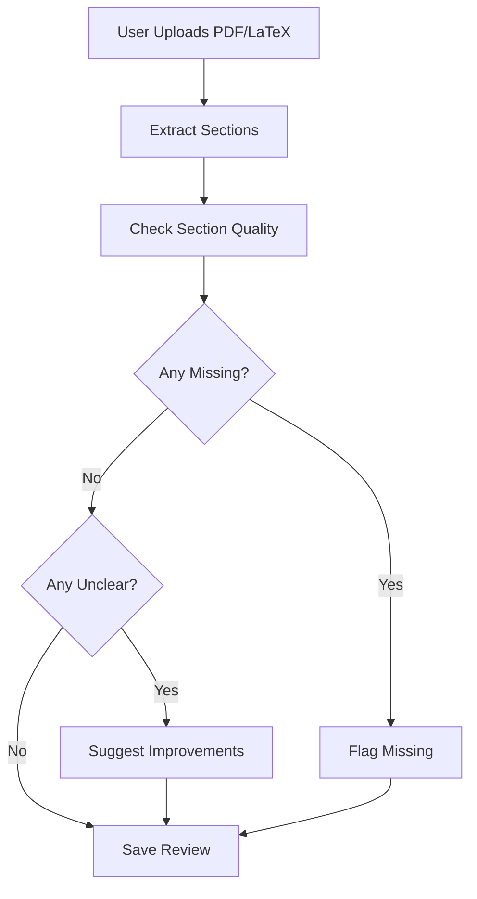

Sure! Here's a professional and clean **README.md** for your **Scientific Paper Checker** project:
# 🧪 Scientific Paper Checker

An AI-powered tool to **analyze research papers** (PDF or LaTeX), extract key sections, assess their quality, and suggest improvements. Built with **LangGraph, LangChain, OpenAI GPT-4, and MongoDB**, this tool serves as a lightweight peer-review assistant for researchers, academic writers, and AI research tools.

---

## 🚀 Features

* 📄 **PDF & LaTeX Support**: Extracts key sections from uploaded papers — `Abstract`, `Methods`, `Results`, `Citations`.
* 🧐 **Section Quality Evaluation**: Uses LLMs to classify each section as `good`, `unclear`, or `missing`.
* 🔄 **Conditional Feedback Flow**:

  * If a section is missing ➔ suggest re-writing.
  * If a section is unclear ➔ generate actionable improvements.
* 💾 **MongoDB Storage**: Saves annotated reviews, section status, and feedback for future reference.

---

## 📂 Project Structure

```
scientific-paper-checker/
│
├── main.py                      # Entry point for running the system
├── langgraph_flow.py            # LangGraph flow definition
├── prompts.py                   # LLM prompt templates
├── state_schema.py              # State schema definition
├── nodes/                       # Nodes for LangGraph
│   ├── extract_sections.py
│   ├── check_quality.py
│   ├── suggest_improvements.py
│   ├── flag_missing.py
│   └── save_review.py
├── utils/                       # Utilities for PDF, MongoDB, etc.
│   ├── pdf_utils.py
│   ├── mongo_utils.py
├── data/                        # Sample papers
├── .env                         # Environment variables (Mongo URI, API keys)
├── requirements.txt             # Python dependencies
└── README.md                    # Project documentation
```

---

## 🔧 Tech Stack

| Purpose            | Technology            |
| ------------------ | --------------------- |
| AI LLM             | OpenAI GPT-4.1        |
| Framework          | LangGraph + LangChain |
| Storage            | MongoDB               |
| PDF Parsing        | PyMuPDF               |
| Backend (optional) | FastAPI / CLI         |

---

## 💡 How It Works



---

## 📥 Sample Input

Upload a research paper PDF with standard sections: Abstract, Methods, Results, Citations.

---

## 📤 Sample Output (MongoDB)

```json
{
    "paper_id": "uuid",
    "sections": {
        "abstract": {"content": "...", "status": "good"},
        "methods": {"content": "...", "status": "unclear"},
        "results": {"content": "...", "status": "good"},
        "citations": {"content": null, "status": "missing"}
    },
    "suggestions": {
        "methods": "Clarify experiment details and metrics."
    },
    "missing_sections": ["citations"]
}
```

---

## 🔨 Setup & Run Locally

1️⃣ Clone the repo:

```bash
git clone https://github.com/ceodaniyal/scientific-paper-checker.git
cd scientific-paper-checker
```

2️⃣ Install dependencies:

```bash
pip install -r requirements.txt
```

3️⃣ Configure `.env`:

```
OPENAI_API_KEY=your-key
MONGO_URI=mongodb://localhost:27017
```

4️⃣ Run:

```bash
python main.py
```

---

## 🔍 Related Topics

* Research Automation Tools
* Academic Writing Assistants
* AI-powered Peer Review
* LangGraph Workflows
* PDF Information Extraction
* MongoDB Document Storage

---

## 🙌 Acknowledgments

Thanks to:

* [LangChain](https://www.langchain.com/)
* [LangGraph](https://www.langgraph.com/)
* [OpenAI](https://openai.com/)
* [MongoDB](https://www.mongodb.com/)
